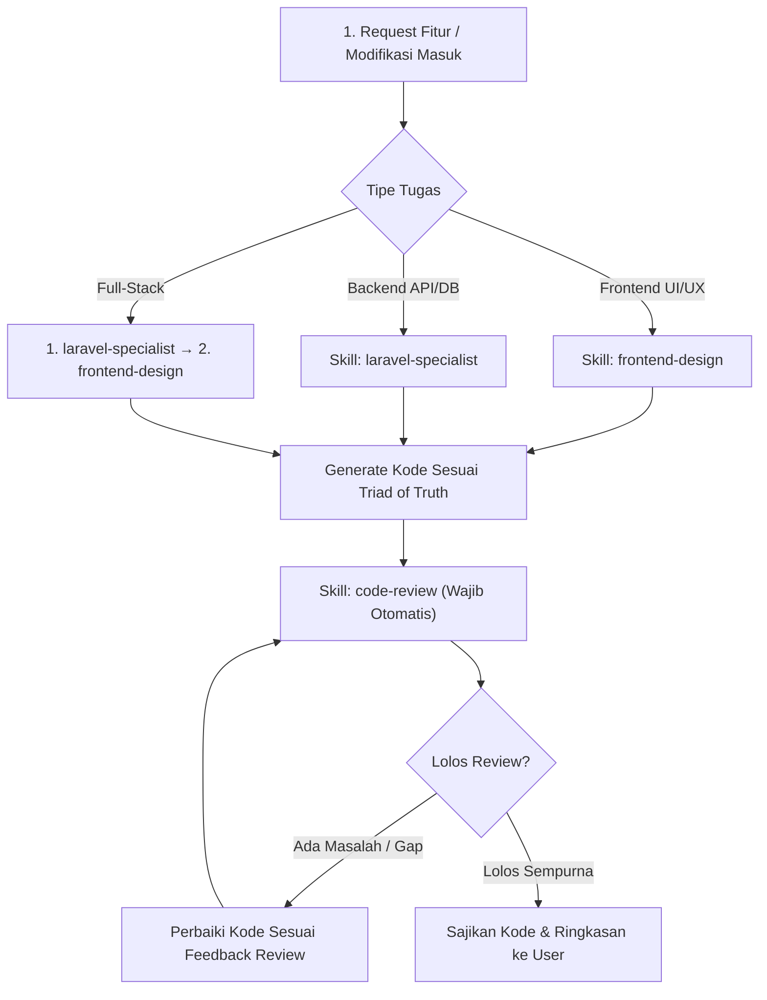

# Development Workflow & Rules: SMK Al-Muhtadin

Dokumen ini adalah pedoman otomatis bagi AI Agent dan developer saat mengimplementasikan fitur, melakukan refaktorisasi, atau memodifikasi kode pada proyek **SMK Al-Muhtadin**.

Setiap pembuatan atau modifikasi fitur **WAJIB** tunduk pada **Triad of Truth** (3 pilar utama proyek):
1. 📋 **Fungsionalitas & Scope**: [`prd_smkalmuhtadin.md`](file:///C:/Users/USER/Documents/Azis/Web/web-smkalmuhtadin/prd_smkalmuhtadin.md) (Versi 2.1)
2. 🎨 **Estetika & Design System**: [`DESIGN.md`](file:///C:/Users/USER/Documents/Azis/Web/web-smkalmuhtadin/DESIGN.md)
3. 🏗️ **Arsitektur & Standar Teknis**: [`architecture.md`](file:///C:/Users/USER/Documents/Azis/Web/web-smkalmuhtadin/architecture.md)

---

## 🔄 Automated Skill & Feature Development Lifecycle

Setiap pengerjaan fitur wajib menjalankan siklus otomatis berikut dengan menggunakan skill yang relevan:

---

### 🛠️ Aturan Eksekusi Skill Terpasang

#### 1. Pengembangan Frontend ➔ Aktifkan Skill `frontend-design`
Setiap kali membuat atau mengubah komponen React, halaman web, layout bento, form CMS, animasi, atau styling Tailwind:
* **Gunakan Panduan Skill**: Wajib memanggil dan menerapkan prinsip dari skill `frontend-design`.
* **Kepatuhan Desain ([`DESIGN.md`](file:///C:/Users/USER/Documents/Azis/Web/web-smkalmuhtadin/DESIGN.md))**:
  - Warna utama: Deep Royal Navy (`#103EA5`), Vibrant Azure (`#3D6BF5`), Prestige Gold (`#E5B62A`), Midnight Navy (`#0A1931`), Charcoal Ink (`#0F172A`).
  - Dilarang keras memakai warna hitam pekat `#000000`, efek neon glow, atau border cyan.
  - Tipografi: Judul & Body menggunakan `Plus Jakarta Sans`, data metrik/angka/NPSN menggunakan `JetBrains Mono`. Dilarang menggunakan font Serif dan font generik `Inter`.
  - Animasi: Gunakan spring physics Motion (`stiffness: 100, damping: 20`).

#### 2. Pengembangan Backend ➔ Aktifkan Skill `laravel-specialist`
Setiap kali membuat migration database, model Eloquent, controller, form request, middleware, atau rute API:
* **Gunakan Panduan Skill**: Wajib memanggil dan menerapkan prinsip dari skill `laravel-specialist`.
* **Kepatuhan Arsitektur ([`architecture.md`](file:///C:/Users/USER/Documents/Azis/Web/web-smkalmuhtadin/architecture.md))**:
  - Standar Database: MySQL 8.x (`BIGINT UNSIGNED AUTO_INCREMENT` untuk PK/FK, native `JSON` untuk payload dinamis).
  - Autentikasi: Laravel Sanctum SPA Bearer token.
  - Media: Upload gambar wajib dikonversi ke format WebP (maks 1920px lebar, kualitas 82%). Video wajib menggunakan embed YouTube (tidak boleh menyimpan file mentah .mp4 di server).
  - Isolasi Logika: Seluruh pemanggilan API diabstraksikan melalui layer `services/`, dan controller wajib merespons menggunakan `JsonResource`.

#### 3. Pasca-Generate Kode ➔ Wajib Jalankan Skill `code-review`
**SEGERA** setelah kode selesai di-generate atau diubah, agen **WAJIB** secara otomatis melakukan audit menggunakan skill `code-review` sebelum menyerahkan hasil kepada pengguna:
* **Kriteria Audit Code Review**:
  1. **Functional Alignment**: Apakah kode memenuhi Acceptance Criteria di [`prd_smkalmuhtadin.md`](file:///C:/Users/USER/Documents/Azis/Web/web-smkalmuhtadin/prd_smkalmuhtadin.md)?
  2. **Type Safety & Clean Code**: Bebas dari `any` liar di TypeScript, tidak ada console.log tertinggal, penamaan variabel jelas dan bermakna.
  3. **Security Check**: Sanitasi input (XSS protection via HTMLPurifier untuk teks TipTap), sanitasi SQL query Eloquent, proteksi upload file MIME-type.
  4. **Performance & A11y**: Lazy loading pada gambar, tidak ada *N+1 query problem* di backend, kontras warna terbaca jelas (WCAG 2.1 AA).
* **Format Output Review**: Sajikan ringkasan singkat hasil code review (status kepatuhan, optimasi yang dilakukan, dan catatan perbaikan jika ada) di bagian akhir jawaban kepada pengguna.
