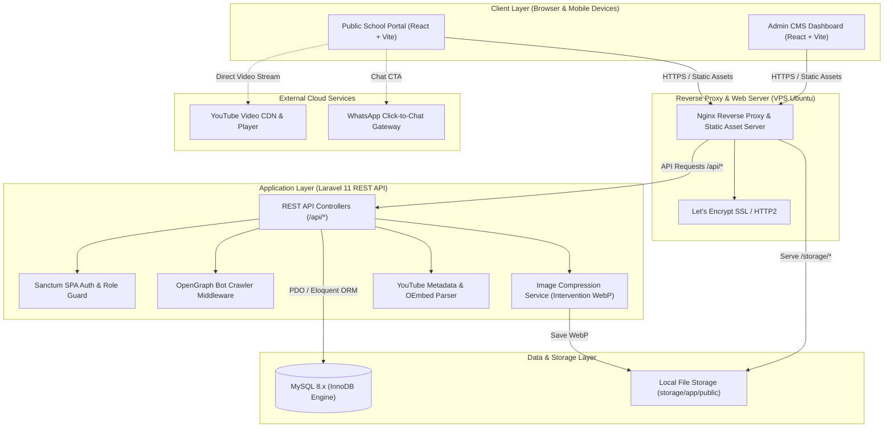
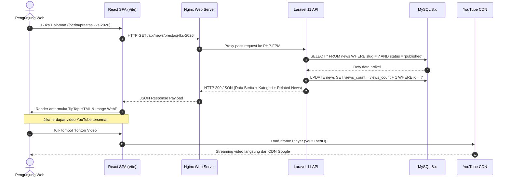
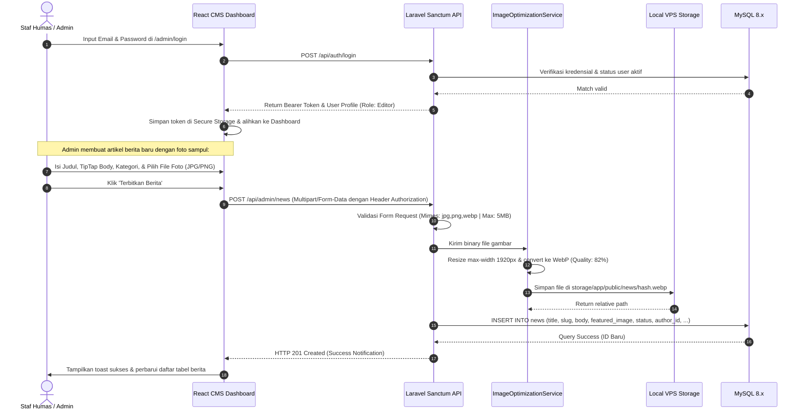
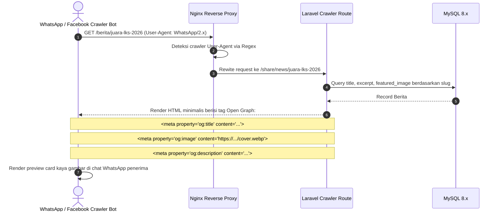

# System Architecture Document: SMK Al-Muhtadin Official Web & CMS
**Version**: 1.0  
**Date**: September 2026  
**Status**: Active Blueprint  
**Primary References**: [`prd_smkalmuhtadin.md`](file:///C:/Users/USER/Documents/Azis/Web/web-smkalmuhtadin/prd_smkalmuhtadin.md) (v2.1) & [`DESIGN.md`](file:///C:/Users/USER/Documents/Azis/Web/web-smkalmuhtadin/DESIGN.md)

---

## 1. System Overview

### 1.1 Architectural Philosophy
Sistem website SMK Al-Muhtadin dirancang dengan pola **Decoupled Client-Server Architecture (Headless CMS & Single Page Application)**. Pemisahan tegas antara layer presentasi (Frontend SPA) dan layer penyedia data (Backend REST API) memberikan keunggulan dalam hal independensi pengembangan, kemudahan pemeliharaan (*maintainability*), isolasi keamanan, dan kecepatan muat (*instant page transition*).



### 1.2 Boundary & Separation of Concerns (SoC)
1. **Public Portal**: Berfokus murni pada pengalaman pengunjung (*user experience*), estetika institusional *Academic Sanctuary Editorial*, aksesibilitas (WCAG 2.1 AA), dan performa rendering kilat.
2. **Admin CMS**: Berada dalam aplikasi yang sama dengan proteksi rute (`AdminRouteGuard`) dan otentikasi token Sanctum, memberikan antarmuka khusus untuk staf sekolah dalam mengelola data master secara terisolasi.
3. **Backend API**: Berperan sebagai *Single Source of Truth* yang mengontrol validasi data, *business logic*, sanitasi input, pemrosesan aset media, dan otorisasi berbasis peran (RBAC).
4. **Data Persistence**: Menggunakan MySQL 8.x dengan relasi berintegritas tinggi melalui *Foreign Key Constraints* dan *Indexing* terarah.

---

## 2. Tech Stack Specification

| Component | Technology | Version | Rationale & Responsibility |
|---|---|---|---|
| **Frontend Framework** | React | `^18.3.1` | Komponen modular, ekosistem kaya, manajemen state reaktif. |
| **Build Tool & Bundler** | Vite | `^6.1.0` | Hot Module Replacement (HMR) instan, kompilasi TypeScript cepat, tree-shaking efisien. |
| **Styling & Design Tokens** | Tailwind CSS | `^3.4.17` | Utility-first CSS yang selaras dengan sistem token di `DESIGN.md`. |
| **Motion Engine** | Motion (Framer Motion) | `^12.4.7` | Animasi mikro interaktif, spring physics pada kartu bento, dan modal transisi. |
| **Icons Library** | Phosphor Icons React | `^2.1.7` | Koleksi ikon konsisten, ringan, dan mendukung berbagai varian (`duotone`, `bold`, `regular`). |
| **Routing** | React Router DOM | `^6.29.0` | Client-side routing berbasis URL, layout nesting, dan route protection. |
| **Backend Framework** | Laravel REST API | `11.x` | Struktur MVC modern, Eloquent ORM, middleware pipeline, dan ekosistem keamanan matang. |
| **Runtime & Language** | PHP | `8.3.x FPM` | Kompilasi JIT, performa tinggi, konsumsi memori rendah untuk request API concurrent. |
| **Authentication** | Laravel Sanctum | `v3.x` | Token-based SPA Authentication yang aman dari serangan CSRF/XSS. |
| **Database** | MySQL | `8.0+ / 8.4 LTS` | RDBMS standar industri, dukungan native JSON, relasi ACID, kompatibel luas dengan VPS. |
| **Media Processing** | Intervention Image | `v3.x` | Auto-resize dan konversi gambar JPEG/PNG ke WebP terkompresi. |
| **Web Server / Proxy** | Nginx | `1.24+` | Menangani SSL termination, static file serving, kompresi Gzip/Brotli, dan reverse proxy ke PHP-FPM. |
| **Host OS** | Ubuntu Server | `22.04 LTS` | Stabilitas jangka panjang, patch keamanan terjamin, efisiensi sumber daya. |

---

## 3. Project Structure (Web & CMS)

### 3.1 Frontend Architecture (`/src`)
Arsitektur frontend mengadopsi pola **Feature-and-Domain Split** yang memisahkan komponen publik, modul CMS admin, dan utilitas pendukung:

```text
web-smkalmuhtadin/
├── public/                     # Static assets (favicon, manifest, placeholder)
├── src/
│   ├── assets/                 # Gambar logo resmi, badge akreditasi, ilustrasi statis
│   ├── components/             # Reusable UI components & layouts
│   │   ├── common/             # Tombol, input, badge, spinner, modal wrapper
│   │   ├── layout/             # Navbar, Footer, Sidebar CMS, Breadcrumbs
│   │   ├── bento/              # Bento card, bento grid containers
│   │   ├── media/              # LightboxModal, VideoModal, ImageWithFallback
│   │   └── guards/             # AdminRouteGuard, RoleBasedGate
│   ├── data/                   # Mock data transisi & default fallback values
│   │   └── mockData.ts         # Data awal sebelum sinkronisasi live backend
│   ├── hooks/                  # Custom React hooks
│   │   ├── useAuth.ts          # State login, peran user, logout trigger
│   │   ├── useNews.ts          # Fetching berita, pagination, filtering
│   │   └── useDebounce.ts      # Debounce pencarian instan
│   ├── pages/                  # Page-level router views
│   │   ├── public/             # Rute publik sekolah
│   │   │   ├── HomePage.tsx            # Beranda bento editorial
│   │   │   ├── ProfilePage.tsx         # Profil sejarah, fasilitas, pimpinan
│   │   │   ├── VisionMissionPage.tsx   # Penjabaran visi & misi terstruktur
│   │   │   ├── MajorsPage.tsx          # Direktori seluruh jurusan (RPL, TKJ, AKL)
│   │   │   ├── MajorDetailPage.tsx     # Silabus, lab, prospek karir, mitra DUDI
│   │   │   ├── StaffPage.tsx           # Direktori GTK & filter kategori
│   │   │   ├── AchievementsPage.tsx    # Showcase prestasi & filter tahun
│   │   │   ├── NewsPage.tsx            # Katalog berita & search bar
│   │   │   ├── NewsDetailPage.tsx      # Artikel berita, TipTap view, share buttons
│   │   │   └── GalleryPage.tsx         # Tab foto lightbox & tab video YouTube
│   │   └── admin/              # Rute panel CMS
│   │       ├── AdminLoginPage.tsx      # Form autentikasi admin
│   │       ├── AdminDashboardPage.tsx  # KPI counter & navigasi tab CMS
│   │       ├── modules/                # Sub-panel CRUD (News, Staff, Videos, Albums)
│   │       └── AdminSettingsPage.tsx   # Konfigurasi WhatsApp, alamat, sosmed
│   ├── services/               # API Client abstraction layer (Axios / Fetch)
│   │   ├── api.ts              # Base Axios instance with auth headers & error interceptor
│   │   ├── newsService.ts      # Endpoint /api/news
│   │   ├── staffService.ts     # Endpoint /api/staff
│   │   └── authService.ts      # Endpoint /api/auth/*
│   ├── styles/                 # Global styles & design system CSS
│   │   ├── index.css           # Tailwind directives & CSS variables
│   │   └── style-guide.css     # Spesifikasi warna, tipografi, dan custom scrollbar
│   ├── types/                  # TypeScript interface & type definitions
│   │   └── index.ts            # Schema News, Staff, Major, Achievement, Video, User
│   ├── utils/                  # Pure utility functions
│   │   ├── formatters.ts       # Format tanggal Indonesia (contoh: '12 September 2026')
│   │   ├── youtubeParser.ts    # Helper ekstraksi 11-digit YouTube ID
│   │   └── majorIcons.tsx      # Mapping Phosphor icon berdasarkan kode jurusan
│   ├── App.tsx                 # Router setup & global context provider
│   └── main.tsx                # Entry point React DOM
├── DESIGN.md                   # Spesifikasi visual & semantic design system
├── prd_smkalmuhtadin.md        # Spesifikasi kebutuhan fungsional & teknis (v2.1)
├── tailwind.config.js          # Token warna (`#103EA5`, `#E5B62A`, dll.)
└── vite.config.ts              # Konfigurasi build Vite & proxy dev server
```

---

### 3.2 Backend Architecture (Laravel 11 API)
Rekomendasi struktur direktori backend Laravel yang bersih dan mematuhi prinsip *Clean Architecture* dan *Action-Domain-Responder*:

```text
backend-smkalmuhtadin/
├── app/
│   ├── Http/
│   │   ├── Controllers/
│   │   │   └── Api/
│   │   │       ├── AuthController.php          # Login, logout, me, refresh token
│   │   │       ├── NewsController.php          # Public & CMS News handler
│   │   │       ├── CategoryController.php      # Kategori berita
│   │   │       ├── MajorController.php         # Program keahlian & mitra DUDI
│   │   │       ├── StaffController.php         # Direktori guru & staf TU
│   │   │       ├── AchievementController.php   # Prestasi & highlight
│   │   │       ├── VideoController.php         # Video YouTube & featured video
│   │   │       ├── GalleryController.php       # Album foto & multi-upload
│   │   │       ├── PageContentController.php   # Konten statis profil & visi-misi
│   │   │       ├── SettingController.php       # Global key-value settings
│   │   │       └── DashboardController.php     # Counter statistik untuk admin CMS
│   │   ├── Middleware/
│   │   │   ├── EnsureUserIsSuperAdmin.php      # Pengecekan role level pimpinan
│   │   │   └── OpenGraphCrawler.php            # Penyaji meta tags untuk bot WhatsApp
│   │   └── Requests/                           # Form Requests (Validasi ketat)
│   │       ├── StoreNewsRequest.php
│   │       ├── UpdateNewsRequest.php
│   │       ├── StoreVideoRequest.php
│   │       └── StoreStaffRequest.php
│   ├── Models/                                 # Eloquent Entities
│   │   ├── User.php
│   │   ├── News.php
│   │   ├── Category.php
│   │   ├── Major.php
│   │   ├── StaffMember.php
│   │   ├── Achievement.php
│   │   ├── Video.php
│   │   ├── Album.php
│   │   ├── GalleryImage.php
│   │   ├── Page.php
│   │   └── Setting.php
│   └── Services/                               # Domain Business Logic
│       ├── ImageOptimizationService.php        # Konversi WebP & resizing
│       └── YouTubeService.php                  # Validasi URL & fetch oEmbed thumbnail
├── database/
│   ├── migrations/                             # Skema tabel MySQL 8.x
│   └── seeders/                                # Data awal (Super Admin, Jurusan, Kategori)
├── routes/
│   ├── api.php                                 # Public & Protected routes
│   └── web.php                                 # Fallback & crawler preview routes
└── storage/
    └── app/public/                             # Folder penyimpanan file WebP terkompresi
```

---

## 4. Data Flow Architecture

### 4.1 Alur Publik (Pengunjung Membaca Berita / Membuka Halaman)
Pengunjung website mengakses halaman publik dengan transisi instan tanpa reload halaman utuh:



---

### 4.2 Alur Otentikasi & Penerbitan Konten CMS Admin
Alur kerja staf Humas atau Admin dalam melakukan autentikasi dan mempublikasikan konten baru:



---

### 4.3 Alur Prerender Social Share (WhatsApp & Facebook Link Preview)
Karena React SPA dirender di sisi client, bot media sosial (yang tidak mengeksekusi JavaScript) dilayani melalui rute khusus agar cuplikan artikel tetap muncul dengan thumbnail dan ringkasan lengkap:



---

## 5. Scalability, Security & Future Considerations

### 5.1 Strategi Kinerja & Skalabilitas (Performance & Caching)
1. **HTTP Caching**: 
   - Aset statis hasil build Vite (`/assets/*.js`, `*.css`, WebP) diberi header `Cache-Control: public, max-age=31536000, immutable`.
   - Endpoint publik yang jarang berubah (seperti `/api/majors`, `/api/pages/*`, `/api/settings`) dilengkapi HTTP ETag / Cache-Control pendek (5-15 menit).
2. **Database Indexing Strategy (MySQL 8.x)**:
   - Indexing khusus pada kolom pencarian: `news(slug)`, `news(published_at, status)`, `categories(slug)`, `staff_members(order_index)`.
   - Menghindari query `N+1` di Laravel dengan konsisten menggunakan Eager Loading (`News::with('category', 'author')`).
3. **Penyimpanan Media Skalabel**:
   - Fase MVP: Media disimpan di disk lokal VPS sekolah (`storage/app/public`) dengan symbolic link.
   - Fase Lanjutan (Jika disk VPS mendekati 80%): Driver filesystem Laravel dapat dialihkan secara transparan ke Object Storage pihak ketiga (Cloudflare R2 atau AWS S3) hanya dengan memperbarui konfigurasi file `.env` tanpa merombak kode.

### 5.2 Strategi Keamanan (Security Hardening)
1. **Sanitasi Konten TipTap**: Input HTML dari editor kaya dibersihkan menggunakan *HTML Purifier* di sisi backend sebelum disimpan ke database untuk mencegah celah *Cross-Site Scripting* (Stored XSS).
2. **Rate Limiting Ketat**: 
   - Endpoint login dibatasi maksimal 5 percobaan per menit per IP untuk menangkal *Brute-Force*.
   - Endpoint publik dibatasi maksimal 60 request per menit per IP untuk mencegah *Spamming / Scraping*.
3. **CORS & Domain Whitelisting**: Hanya domain resmi sekolah (`smkalmuhtadin.sch.id`) dan lingkungan dev lokal terdaftar yang diizinkan mengakses API dengan kredensial.
4. **Proteksi File Upload**: Verifikasi *MIME-type* asli melalui ekstensi PHP `fileinfo`, bukan sekadar memeriksa ekstensi nama file yang dikirim oleh client.

### 5.3 Pemeliharaan & Operasional (Runbook & Disaster Recovery)
1. **Backup Otomatis MySQL**: Menjalankan cron job harian pada pukul 02:00 WIB untuk membuat snapshot database menggunakan `mysqldump` terkompresi Gzip dan menyimpannya ke direktori terisolasi atau offsite storage.
2. **Log Rotation**: Membatasi ukuran file log Nginx dan Laravel agar tidak memenuhi kapasitas disk server.
3. **Zero-Downtime Deployment Sederhana**: Menggunakan Git pull webhook atau script bash yang menjalankan build Vite, `php artisan migrate --force`, dan `php artisan config:cache` tanpa memutus koneksi pengguna.

---

## 6. Matrix Keterhubungan Dokumen

Dokumen arsitektur ini terhubung erat dan saling melengkapi dengan dokumen proyek lainnya:
* **Fungsionalitas & Lingkup Fitur**: Merujuk penuh pada [`prd_smkalmuhtadin.md`](file:///C:/Users/USER/Documents/Azis/Web/web-smkalmuhtadin/prd_smkalmuhtadin.md).
* **Standar Estetika & Desain**: Mengikuti batasan warna, bento card grid, dan tipografi pada [`DESIGN.md`](file:///C:/Users/USER/Documents/Azis/Web/web-smkalmuhtadin/DESIGN.md).
* **Kode Sumber Frontend Aktif**: Diimplementasikan pada folder [`/src`](file:///C:/Users/USER/Documents/Azis/Web/web-smkalmuhtadin/src).
